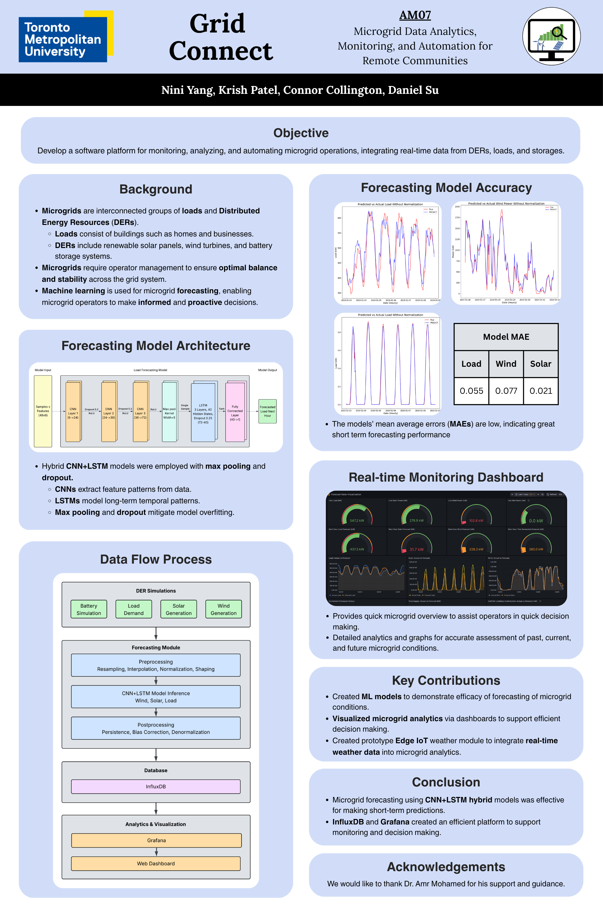
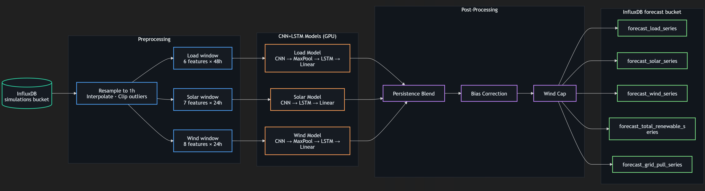
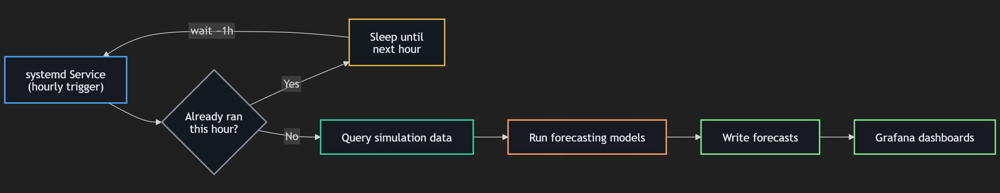
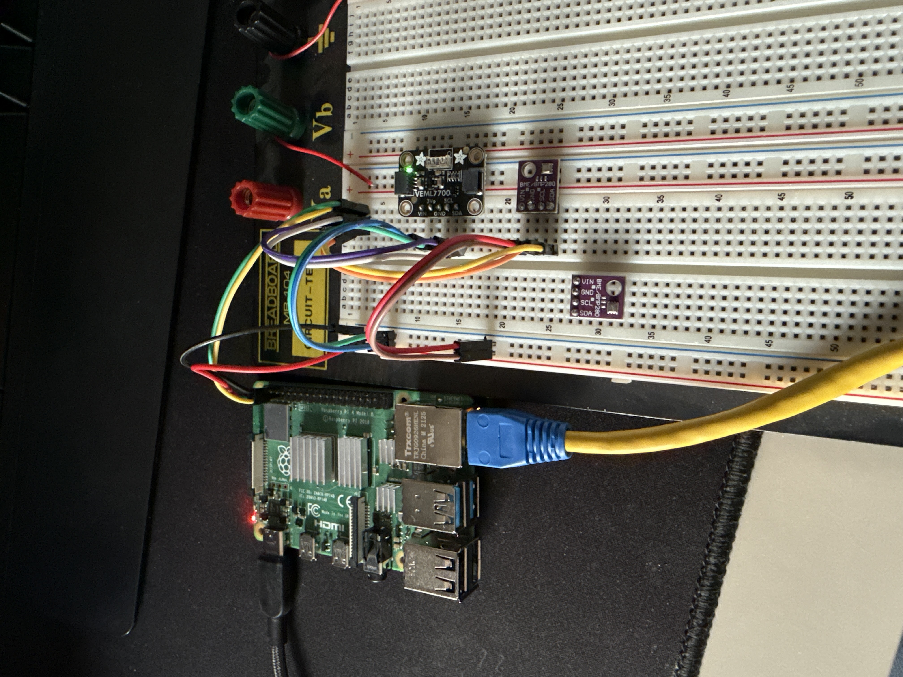

# Grid Connect
**Microgrid Data Analytics, Monitoring, and Automation for Remote Communities**

> AM07 · Electrical & Computer Engineering Capstone · Toronto Metropolitan University · 2025
>
> Nini Yang · Krish Patel · Connor Collington · Daniel Su
>
> Supervised by Dr. Amr Mohamed

<p align="center">
  
</p>

---

## About This Repository

This project was completed as part of the 2025 Electrical & Computer Engineering Capstone at Toronto Metropolitan University. This repository is maintained by Krish Patel and is intended to share the publicly available portions of the project. The full system was built collaboratively alongside teammates Nini Yang, Connor Collington, and Daniel Su.

📄 **[View Full Project Report](Grid-Connect_Capstone-Report.pdf)**

---

## Overview

Grid Connect is an end-to-end software platform for monitoring, analyzing, and automating microgrid operations. It integrates real-time data from distributed energy resources (DERs) - solar, wind, and battery storage - with machine learning forecasting models and a live Grafana dashboard to help operators make proactive, data-driven decisions.

The system was designed with remote and off-grid communities in mind, where access to main utility infrastructure is limited or unavailable.

---

## Features

- **DER Simulator** - Replays real historical data (Penmanshiel wind farm, UCSD microgrid) to emulate live solar, wind, load, and battery conditions via a JSON HTTP API
- **CNN+LSTM Forecasting Models** - Three independently trained hybrid models forecasting the next hour of load demand, solar generation, and wind power
- **Live Inference Pipeline** - Hourly systemd daemon that queries InfluxDB, runs PyTorch inference, applies post-processing (persistence blending, bias correction, wind cap), and writes forecasts back to InfluxDB
- **InfluxDB + Telegraf** - Time-series database with a Telegraf ingestion layer supporting multiple data sources
- **Grafana Dashboards** - Real-time and historical dashboards for load, generators, storage, and model accuracy statistics
- **Real-time Alerting** - Discord notifications via Grafana for abnormal generation, load, and battery conditions
- **RPi Weather Station** - Raspberry Pi 4B with BME280 and VEML7700 sensors in a custom 3D-printed enclosure, streaming local temperature, humidity, pressure, and lux readings

---

## Model Performance

| Model | Normalized MAE | 7-Day Live MAE |
|-------|---------------|----------------|
| Load  | 0.052         | 42.6 kW        |
| Solar | 0.021         | 37.5 kW        |
| Wind  | 0.077         | 66.0 kW        |

---

## System Architecture

### Inference Pipeline

<p align="center">
  
</p>

The inference pipeline reads from the InfluxDB simulations bucket, preprocesses data into per-model feature windows, runs all three CNN+LSTM models on GPU, and applies post-processing (persistence blending, bias correction, wind cap) before writing five forecast series back to InfluxDB.

### Scheduling Daemon

<p align="center">
  
</p>

A systemd service triggers the pipeline once per hour. A state-file deduplication guard prevents repeated execution within the same hour window.

---

## Tech Stack

| Layer | Technology |
|-------|-----------|
| Database | InfluxDB, Telegraf |
| ML Framework | PyTorch |
| Inference Scheduling | systemd timer daemon |
| Visualization | Grafana |
| Web Dashboard | Custom frontend |
| DER Simulator | Python + Flask HTTP API |
| Weather Station | Raspberry Pi 4B, BME280, VEML7700 |
| Infrastructure | Ubuntu Server VMs |

---

## Weather Station

<p align="center">
  
</p>

The weather station was built around a Raspberry Pi 4B with a BME280 sensor (temperature, humidity, barometric pressure) and a VEML7700 ambient light sensor (lux), connected over I2C. The unit was housed in a custom 3D-printed enclosure designed with angled vents, drainage holes, and an elevated base for outdoor durability.

---

## Repository Structure

```
Grid-Connect_Capstone/
├── simulator/          # DER simulator (wind, solar, load, battery state machine)
├── models/             # CNN+LSTM model definitions, training scripts, saved weights
│   ├── load/
│   ├── solar/
│   └── wind/
├── inference/          # Live inference pipeline and scheduling daemon
├── dashboard/          # Grafana dashboard JSON configs and web frontend
├── weather-station/    # RPi sensor scripts and data ingestion
├── data/               # Data preprocessing and dataset utilities
├── Images/
│   ├── AM07-Capstone-Poster.png
│   └── readme/
└── Grid-Connect_Capstone-Report.pdf
```

---

## Datasets

| Dataset | Source | Used For |
|---------|--------|----------|
| Penmanshiel Wind Farm | Zenodo | Wind model training (2017–2024) |
| UCSD Microgrid | Journal of Renewable and Sustainable Energy | Load & solar model training (2015–2020) |
| NSRDB (NLR) | National Lab of the Rockies | Atmospheric features for solar model |

---

## Acknowledgements

We thank **Dr. Amr Mohamed** for his guidance and support throughout this project.
